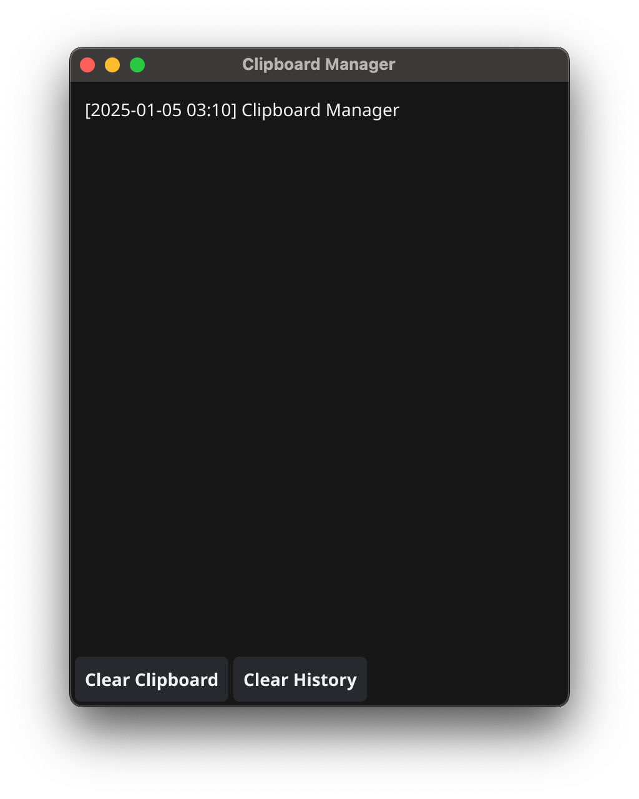

# Clipboard Manager
   
A simple and efficient clipboard manager built with [Fyne](https://fyne.io/) and Go. This application monitors your clipboard, saves its history, and provides a user-friendly interface for managing clipboard content.

## Features

- **Clipboard Monitoring**: Automatically saves copied text to a history list.
- **History Management**: View, copy, or clear clipboard history.
- **System Tray Integration**: Minimize the application to the system tray and restore it when needed.
- **Customizable Tray Icon**: Easily set your own icon for the system tray.
- **Platform**: Works on macOS.

## Screenshots

## Requirements

- Go 1.19 or higher
- [Fyne Toolkit](https://fyne.io/) (included via Go modules)
- [golang.design/x/clipboard](https://pkg.go.dev/golang.design/x/clipboard) library for clipboard handling
